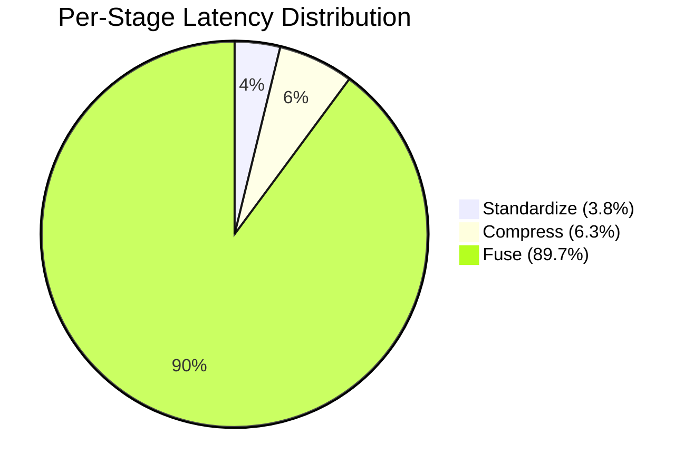
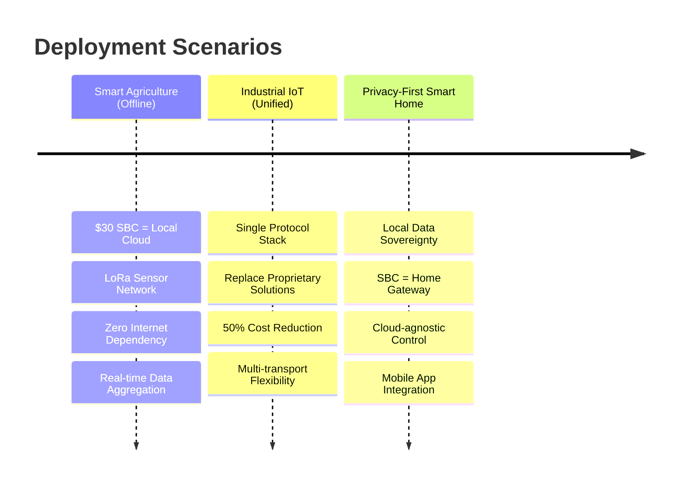

# OpenSynaptic

**2-N-2 high-performance IoT protocol stack** — standardises sensor readings into UCUM units, compresses them via Base62 encoding, wraps them in a binary packet, and dispatches over pluggable transporters (TCP / UDP / UART / LoRa / MQTT / CAN).

## Try In 30 Seconds

```powershell
pip install -e .
os-node demo --open-browser
```

Windows (no `Activate.ps1` required):

```powershell
.\run-main.cmd demo --open-browser
```

- Default user config path: `~/.config/opensynaptic/Config.json`
- First run launches onboarding wizard (`--yes` / `--no-wizard` supported)

### CLI Completion (Tab)

```powershell
py -3 -m pip install argcomplete
powershell -ExecutionPolicy Bypass -File .\scripts\enable_argcomplete.ps1
```

Manual (without script):

```powershell
Invoke-Expression (register-python-argcomplete os-node --shell powershell)
```

Restart PowerShell after activation.


---

## Table of Contents

- [Architecture](#architecture)
- [Prerequisites](#prerequisites)
- [Install](#install)
- [Why OpenSynaptic?](#why-opensynaptic)
- [Performance at a Glance](#performance-at-a-glance)
- [Use Cases](#use-cases)
- [Minimal Usage](#minimal-usage)
- [CLI Quick Reference](#cli-quick-reference)
- [Config.json](#configjson)
- [Testing](#testing)
- [Native And Rust Build](#native-and-rust-build)
- [Adding a Transporter](#adding-a-transporter)
- [API Reference](#api-reference)
- [Documentation Hub](#documentation-hub)
- [Plugin Config Auto-Sync](#plugin-config-auto-sync)

---

## Architecture

```mermaid
%%{init: {'flowchart': {'rankSeparation': 60, 'nodeSeparation': 50}}}%%
graph LR
    A["Sensors List"] -->|Raw Data| B["Standardizer<br/>(UCUM Normalisation)"]
    B -->|Standardised| C["Compressor<br/>(Base62 Encoding)"]
    C -->|Compressed| D["Fusion Engine<br/>(FULL/DIFF Packet)"]
    D -->|Binary Packet| E["Dispatcher<br/>(TCP/UDP/LoRa/MQTT/CAN)"]
    E -->|Transmitted| F["Remote Node"]
    
    style A fill:#e1f5ff
    style B fill:#fff3e0
    style C fill:#f3e5f5
    style D fill:#e8f5e9
    style E fill:#fce4ec
    style F fill:#e0f2f1
```



**Pipeline Overview (Text):**
```
sensors list
    → OpenSynapticStandardizer.standardize()   # UCUM normalisation
    → OpenSynapticEngine.compress()            # Base62 solidity compression
    → OSVisualFusionEngine.run_engine()        # binary packet (FULL / DIFF strategy)
    → OpenSynaptic.dispatch(medium="UDP")      # physical send via transporter
```

```
src/opensynaptic/
├── core/
│   ├── __init__.py             # Public core facade + active backend loader
│   ├── pycore/
│   │   ├── core.py             # Orchestrator – OpenSynaptic class
│   │   ├── standardization.py  # UCUM normalisation
│   │   ├── solidity.py         # Base62 compress / decompress
│   │   ├── unified_parser.py   # Binary packet encode/decode, template learning
│   │   ├── handshake.py        # CMD byte dispatch, device ID negotiation
│   │   └── transporter_manager.py # Auto-discovers pluggable transporters
│   ├── rscore/                 # Rust core backend + build/check helpers
│   ├── transport_layer/        # L4 protocol managers and protocols/
│   ├── physical_layer/         # PHY protocol managers and protocols/
│   ├── layered_protocol_manager.py # 3-layer protocol orchestration
│   ├── coremanager.py          # Core selection/runtime manager
│   └── loader.py               # Core/plugin loader
├── services/
│   ├── service_manager.py      # Plugin mount / load / dispatch hub
│   ├── plugin_registry.py      # Built-in plugin mapping + config default sync
│   ├── tui/                    # Terminal UI service (section-aware, interactive)
│   ├── web_user/               # Lightweight web UI + user management API
│   ├── dependency_manager/     # Dependency check/repair/install plugin
│   ├── env_guard/              # Environment guard service
│   ├── transporters/           # Application-layer transporter service
│   ├── db_engine/              # Database integration service
│   └── test_plugin/            # Built-in component & stress test suite
├── utils/
│   ├── constants.py            # LogMsg enum, MESSAGES, CLI_HELP_TABLE
│   ├── logger.py               # os_log singleton
│   ├── paths.py                # OSContext, read_json, write_json, get_registry_path
│   ├── base62/                 # Base62 codec bindings/utilities
│   ├── security/               # crc/xor/session-key helpers
│   └── c/                      # Native loader/build helpers
├── CLI/
│   └── app.py                  # Argparse CLI (os-node entrypoint)
plugins/
└── id_allocator.py             # uint32 ID pool, persisted to data/id_allocation.json
libraries/
└── Units/                      # UCUM unit definition JSON files
scripts/
├── integration_test.py
├── udp_receive_test.py
├── audit_driver_capabilities.py
├── services_smoke_check.py
└── cli_exhaustive_check.py
Config.json                     # Single source of truth for all runtime settings
```

---

## Prerequisites

- Python 3.11+
- Optional: `mysql-connector-python`, `psycopg[binary]`, `aioquic` (see `pyproject.toml`)

---

## Install

```powershell
pip install -e .
```

### Windows PowerShell Startup Note

If you see this error when activating a virtual environment:

```text
Activate.ps1 cannot be loaded because running scripts is disabled on this system.
```

Use the project wrappers and run without activation:

```powershell
.\scripts\venv-python.cmd -m pip install -e .
.\scripts\venv-python.cmd -m pytest tests/unit tests/integration -q
.\scripts\venv-python.cmd -u src/main.py --help
.\run-main.cmd --help
```

If you need activation in the current shell only:

```powershell
Set-ExecutionPolicy -Scope Process -ExecutionPolicy Bypass
& ".\.venv\Scripts\Activate.ps1"
```

### First-Run Native Auto Repair

On first run, OpenSynaptic now auto-attempts native C binding repair if required runtime libraries are missing.

- Trigger point: first run startup preflight and node initialization failure fallback.
- What it does: runs the same native build pipeline as `native-build`, then retries node startup once.
- If compiler/toolchain is missing, it returns structured guidance and records environment hints through `env_guard`.

Disable this behavior only when needed:

```powershell
$env:OPENSYNAPTIC_AUTO_NATIVE_REPAIR = "0"
```

---

## Why OpenSynaptic?

OpenSynaptic is not a replacement for MQTT or CoAP — it solves a different problem. While MQTT/CoAP handle **transport**, OpenSynaptic focuses on **what you do with sensor data before it hits the wire**.

### The Real Problem

When you deploy IoT sensors from different vendors, you face three universal headaches:

| Problem | Example |
|---|---|
| **Unit chaos** | Sensor A sends `"pressure": 101.3, "unit": "kPa"`, Sensor B sends `"p": 14.7, "u": "psi"` |
| **Verbose encoding** | `{"sensor_id": "temp_01", "value": 23.5, "unit": "celsius"}` → 62 bytes for 4 bytes of data |
| **Transport fragmentation** | Need TCP for reliability, UDP for speed, LoRa for range, CAN for automotive — five different codebases |

### What OpenSynaptic Does Differently

| Layer | Traditional Approach | OpenSynaptic |
|---|---|---|
| **Semantic normalization** | Application code | ✅ Built-in UCUM |
| **Payload compression** | Optional library (zlib/lz4) | ✅ Built-in Base62 + DIFF (60–80% reduction vs. JSON) |
| **Transport abstraction** | Rewrite per medium | ✅ Single API: TCP/UDP/LoRa/CAN/MQTT |
| **Binary encoding** | Custom or Protobuf | ✅ Zero-copy pipeline |

### Performance Comparison (Apples-to-Apples)

**The numbers below compare CPU processing time only** — what happens inside your application before network transmission. Network latency (which dominates end-to-end delay) is excluded because it depends on your infrastructure, not your protocol choice.

| Metric | MQTT + JSON (paho-mqtt) | CoAP (aiocoap) | **OpenSynaptic** |
|---|---|---|---|
| **Processing latency** (single sensor, Python) | ~150–300 μs | ~80–200 μs | **9.7 μs** |
| **Throughput** (single core) | ~8K–15K ops/s | ~10K–20K ops/s | **1.2M ops/s**† |
| **Payload size** (temperature: 23.5°C) | ~60 bytes | ~40 bytes | **~16 bytes** |
| **Compression ratio** (vs. JSON) | N/A | N/A | **60–80% reduction** |

*OpenSynaptic: batch_fused mode, 16 processes, R5 9600X. See [Performance at a Glance](#performance-at-a-glance).*

> ⚠️ **Important**: These are **protocol + serialization** benchmarks, not end-to-end network latency. MQTT/CoAP add 1–10 ms for broker/network round trips — OpenSynaptic would add the same when deployed over real networks. The advantage is in **processing efficiency**, not physics-defying network speed.

### When to Use What

| If you need... | Use... |
|---|---|
| **Standard IoT cloud connectivity** (AWS IoT, Azure IoT Hub) | MQTT |
| **REST-like request/response over UDP** | CoAP |
| **Sensor normalization + compression + multi-transport in one stack** | **OpenSynaptic** |
| **Maximum processing throughput on constrained hardware** | **OpenSynaptic** |
| **Already have a working MQTT/CoAP deployment** | Keep it. Add OpenSynaptic for preprocessing. |

### OpenSynaptic as a Preprocessor

OpenSynaptic doesn't force you to abandon existing infrastructure. Use it as a **preprocessing layer** before MQTT:

```python
# Standardize and compress sensor data, then send via MQTT
node = OpenSynaptic()
packet, _, _ = node.transmit(sensors=[["temp", "OK", 23.5, "cel"]])
mqtt_client.publish("sensors/data", packet.hex())  # 16 bytes instead of 60
```
---

## ⚡ Performance at a Glance


Color legend: `R5 9600X = active`, `i7-9750H = crit`, `i7_9750H = active`.

> **Note**: The chart above uses user-provided run data. Because run profiles differ (`total`, `processes`, `threads`, `batch`, `chain_mode`), treat it as an engineering reference rather than a strict A/B benchmark.

```mermaid
gantt
  title CPU Processing Time by Percentile (us)
  dateFormat x
  axisFormat %Q
  section AVG
  R5_9600X 10.7us   : a1, 0, 11
  RK3588 31.5us   :crit, a2, 0, 32
  i7_9750H 21.8us     :active, a3, 0, 22

  section P95
  R5_9600X 36.8us   :b1, 0, 37
  RK3588 88.4us   :crit, b2, 0, 88
  i7_9750H 54.7us     :active, b3, 0, 55

  section P99
  R5_9600X 68.6us   : c1, 0, 69
  RK3588 186.1us  :crit, c2, 0, 186
  i7_9750H 89.7us     :active, c3, 0, 90

  section P99.9
  R5_9600X 109.8us  : d1, 0, 110
  RK3588 461.2us  :crit, d2, 0, 461
  i7_9750H 192.9us    :active, d3, 0, 193

  section P99.99
  R5_9600X 109.8us  : e1, 0, 110
  RK3588 811.6us  :crit, e2, 0, 812
  i7_9750H 338.8us    :active, e3, 0, 339

  section MAX
  R5_9600X 141.5us  : f1, 0, 142
  RK3588 2012.9us :crit, f2, 0, 2013
  i7_9750H 436.4us    :active, f3, 0, 436
```



Chart scale note: bars are shown in approximate microseconds (us) for readability, grouped by percentile for faster cross-CPU comparison.

> **Note**: This simplified view shows only total per-packet CPU processing latency from user-provided `batch_fused` runs. If you need stage-level timing (`standardize_ms` / `compress_ms` / `fuse_ms`), use `--pipeline-mode legacy` in single-process mode.

### Legacy Mode (Precise Per-Stage Timing)

For accurate per-stage breakdown, use `--pipeline-mode legacy` with **single process only**:

```bash
python -u src/main.py plugin-test --suite stress --total 1 \
  --chain-mode core --pipeline-mode legacy --processes 1 --threads-per-process 1
```

**Legacy Mode Pipeline Timing Breakdown:**



> **Key Insight**: Fusion (binary packet construction) dominates latency in legacy mode; batch_fused optimization reduces this bottleneck significantly.

⚠️ **Legacy Mode Caveats:**
- Throughput artificially low (~1-5K pps) due to global lock in result collector, not representative of actual system speed
- Latency data accuracy , but don't use pps metric for performance tuning
- Use batch_fused (above) for realistic performance profiling

 [Full Benchmark Report](docs/reports/PERFORMANCE_OPTIMIZATION_REPORT.md)

---

##  Use Cases



**Detailed Scenarios:**

### Smart Agriculture (Offline)
Deploy a $30 SBC as a local cloud, aggregating data from LoRa sensors. No internet required.

### Industrial IoT (Unified)
Replace multiple proprietary protocols with a single OpenSynaptic stack, reducing integration cost by 50%.

### Privacy-First Smart Home
Keep all sensor data on a local SBC; control via mobile app without exposing data to public cloud.

---

## Minimal Usage

```python
from opensynaptic.core import OpenSynaptic

node = OpenSynaptic()                        # reads Config.json automatically
node.ensure_id("192.168.1.100", 8080)        # request device ID from server
packet, aid, strategy = node.transmit(sensors=[["V1", "OK", 3.14, "Pa"]])
node.dispatch(packet, medium="UDP")
```

```python
from opensynaptic.core import get_core_manager

manager = get_core_manager()
print(manager.available_cores())             # e.g. ['pycore', 'rscore']
manager.set_active_core('pycore')
OpenSynaptic = manager.get_symbol('OpenSynaptic')
```

---

## CLI Quick Reference

All commands are available via `os-node` (installed entrypoint), `./run-main.cmd` (Windows), or `python -u src/main.py`:

**Command Categories:**

-  **Runtime**: `run`, `restart`, `snapshot`, `ensure-id`, `transmit`, `inject`, `decode`, `watch`, `tui`
- ️ **Config**: `config-show`, `config-get`, `config-set`, `core`, `transporter-toggle`
-  **Plugin**: `plugin-list`, `plugin-load`, `plugin-cmd`, `web-user`, `deps`
-  **Testing**: `plugin-test`, `native-check`, `native-build`, `rscore-build`, `rscore-check`
-  **Monitor**: `transport-status`, `db-status`, `help`

### All Commands

| Category | Command | Description |
|---|---|---|
| **Runtime** | `run` | Persistent run loop with heartbeat |
| **Runtime** | `restart` | Gracefully restart the run loop (stop + auto-start new process) |
| **Runtime** | `snapshot` | Print node/service/transporter JSON snapshot |
| **Runtime** | `ensure-id` | Request device ID from server |
| **Runtime** | `transmit` | Encode one sensor reading and dispatch |
| **Runtime** | `inject` | Push data through pipeline stages and inspect output |
| **Runtime** | `decode` | Decode a binary packet (hex) or Base62 string back to JSON |
| **Runtime** | `watch` | Real-time poll a module's state (config / registry / transport / pipeline) |
| **Runtime** | `tui` | Render TUI snapshot (add `--interactive` for live mode) |
| **Config** | `config-show` | Display Config.json or a specific section |
| **Config** | `config-get` | Read a dot-notation key path from Config |
| **Config** | `config-set` | Write a typed value to a Config key path |
| **Config** | `core` | Show/switch core backend (`pycore` / `rscore`) |
| **Config** | `transporter-toggle` | Enable or disable a transporter in Config |
| **Plugin** | `plugin-list` | List mounted service plugins |
| **Plugin** | `plugin-load` | Load a mounted plugin by name |
| **Plugin** | `plugin-cmd` | Route a sub-command to a plugin's CLI handler |
| **Plugin** | `web-user` | Run web_user plugin directly from CLI |
| **Plugin** | `deps` | Run dependency_manager plugin directly from CLI |
| **Testing** | `plugin-test` | Run component or stress tests |
| **Testing** | `native-check` | Check native compiler/toolchain availability |
| **Testing** | `native-build` | Build native C bindings (optionally include RS core) |
| **Testing** | `rscore-build` | Build and install Rust RS core shared library |
| **Testing** | `rscore-check` | Check RS core DLL/runtime readiness and active core |
| **Monitor** | `transport-status` | Show all transporter layer states |
| **Monitor** | `db-status` | Show DB engine status |
| **Monitor** | `help` | Print full help |

Full usage examples → [`src/opensynaptic/CLI/README.md`](src/opensynaptic/CLI/README.md)

---

## Config.json

`Config.json` at the project root is the single source of truth.
Key fields:

| Key | Type | Default | Effect |
|---|---|---|---|
| `assigned_id` | uint32 | `4294967295` | Device ID; `4294967295` = unassigned |
| `engine_settings.precision` | int | `4` | Base62 decimal places |
| `engine_settings.active_standardization` | bool | `true` | Toggle UCUM normalisation stage |
| `engine_settings.active_compression` | bool | `true` | Toggle Base62 compression stage |
| `RESOURCES.transporters_status` | map | `{}` | Legacy merged compatibility map (mirrors layer-specific status maps) |
| `security_settings.drop_on_crc16_failure` | bool | `true` | Drop packets with bad CRC |

Full schema → [`docs/CONFIG_SCHEMA.md`](docs/CONFIG_SCHEMA.md)

---

## Testing

**Test Suite Options:**

| Suite | Purpose | Command |
|---|---|---|
| `component` | Unit-level component tests | `plugin-test --suite component` |
| `stress` | High-volume performance tests | `plugin-test --suite stress --workers 8 --total 200` |
| `integration` | End-to-end integration tests | `plugin-test --suite integration` |
| `all` | Complete test coverage | `plugin-test --suite all` |

**Quick Commands:**

```powershell
# Windows shortcut (no Activate.ps1 needed)
.\run-main.cmd plugin-test --suite component

# Component tests (unit-level)
python -u src/main.py plugin-test --suite component

# Stress test (high throughput)
python -u src/main.py plugin-test --suite stress --workers 8 --total 200

# All suites combined
python -u src/main.py plugin-test --suite all

# If tests fail, repair dependencies
python -u src/main.py deps --cmd check
python -u src/main.py deps --cmd repair

# Then retry the test suite

# Additional testing scripts
python scripts/integration_test.py
python scripts/udp_receive_test.py --protocol udp --host 127.0.0.1 --port 8080 --config Config.json
python scripts/audit_driver_capabilities.py
python scripts/services_smoke_check.py
```

**Comprehensive Repeatable Pipeline:**

```powershell
# Full-scale reproducible validation (recommended default)
python -u scripts/extreme_validation_pipeline.py --scale full

# Lightweight CI smoke pass
python -u scripts/extreme_validation_pipeline.py --scale smoke

# Maximum workload, fail on any step
python -u scripts/extreme_validation_pipeline.py --scale extreme --strict
```

The runner writes a single aggregated JSON report to:

`data/benchmarks/extreme_validation_report_latest.json`

It also updates per-suite benchmark artifacts under `data/benchmarks/` (compare, stress, protocol matrix, CLI exhaustive report).

---

## Native And Rust Build

**Backend Options:**

| Backend | Type | Toolchain Required | Best For |
|---|---|---|---|
| `pycore` | Pure Python | Optional (C compiler) | Balanced, easy setup |
| `rscore` | Rust + FFI | Required (Rust + MSVC/Clang) | Maximum performance |

**Quick Start:**

1. **Check what you have:**
   ```powershell
   python -u src/main.py native-check      # Check toolchain availability
   ```

2. **Build native bindings (for pycore):**
   ```powershell
   python -u src/main.py native-build      # Build C bindings
   ```

3. **Build Rust backend (optional, for rscore):**
   ```powershell
   python -u src/main.py rscore-build      # Build Rust core
   python -u src/main.py rscore-check      # Verify installation
   ```

4. **Switch active core (persistent):**
   ```powershell
   # Use Rust core
   python -u src/main.py core --set rscore --persist
   
   # Or switch back to Python core
   python -u src/main.py core --set pycore --persist
   ```

**Windows Shortcuts (no Activate.ps1 needed):**

```powershell
.\run-main.cmd native-check
.\run-main.cmd native-build
```

---

## Adding a Transporter

See [`docs/TRANSPORTER_PLUGIN.md`](docs/TRANSPORTER_PLUGIN.md).

---

## API Reference

See [`docs/API.md`](docs/API.md).

Core facade and loader reference -> [`docs/CORE_API.md`](docs/CORE_API.md)

---

## Documentation Hub

- Repository docs map: [`docs/INDEX.md`](docs/INDEX.md)
- Start here: [`docs/README.md`](docs/README.md)
- Architecture walkthrough: [`docs/ARCHITECTURE.md`](docs/ARCHITECTURE.md)
- Config schema: [`docs/CONFIG_SCHEMA.md`](docs/CONFIG_SCHEMA.md)
- Transporter/plugin extension: [`docs/TRANSPORTER_PLUGIN.md`](docs/TRANSPORTER_PLUGIN.md)
- Core internals: [`docs/internal/PYCORE_INTERNALS.md`](docs/internal/PYCORE_INTERNALS.md)
- Rust core references: [`docs/RSCORE_API.md`](docs/RSCORE_API.md), [`docs/PYCORE_RUST_API.md`](docs/PYCORE_RUST_API.md)
- ID lease docs: [`docs/ID_LEASE_SYSTEM.md`](docs/ID_LEASE_SYSTEM.md), [`docs/ID_LEASE_CONFIG_REFERENCE.md`](docs/ID_LEASE_CONFIG_REFERENCE.md)

---

## Plugin Config Auto-Sync

Built-in plugin settings are stored in `Config.json` at:

`RESOURCES.service_plugins.<plugin_name>`

These entries are auto-created with defaults if missing; plugins remain manual-start and do not auto-run at process
